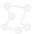

# PolyTrace: What is this?

PolyTrace is a tool which allows users to create 2D polygons and export them as JSON data. You can load images and trace polygons around them or just work from scratch. PolyTrace will also identify whether a polygon is convex or concave. But it will export all types!

# How to build

PolyTrace is a [Processing](http://processing.org/) sketch. To run it download Processing and place the code in your Processing sketchbook location in a directory called PolyTrace. PolyTrace uses the [Gson](http://code.google.com/p/google-gson/) library, but unusually due to issues on my part, that's been included for now in this repository. Ideally it would be installed into the libraries directory in the sketchbook location.

From within Processing you can, if you want to, export PolyTrace as a standalone application. For Mac users, the repository includes sketch.icns with which you can replace the default icon Processing puts in the .app it generates. 

# GUI and Shortcuts (Mac Only)

Load an existing polygon trace (will load the image associated with the trace as well). Any unsaved changes will be lost. _(Cmd+o)_  

Save the current polygon trace (will include a reference to the current image file). _(Cmd+s)_  

Opens an image to trace. Any unsaved changes will be lost. _(i)_  

Starts a new polygon. _(p)_  

Zoom in on the centre of the screen.  

Zoom out of centre of the screen.  

# Instructions

The first step is always to load an image to trace, you can do that by clicking the icon (see above or press 'i'). Once the image is selected you can start tracing a polygon.

## Add point to polygon
To add a point to the polygon, click on the place on the screen where you want to add the point.

## To delete a point from the polygon
You can delete the current selected point, which by default is the last point added, by hitting the backspace key.

## Selecting a point
You can select a point on a polygon by clicking on it. New points will be added after this point on the polygon.

## Changing a point
You can move a point by dragging it with the mouse.

## Starting a new polygon
Press 'p' to start adding points to a new polygon. You can select other polygons by clicking on a point on them.

## Convex vs. Concave Polygons
PolyTrace will render concave polygons with a red fill colour. Convex polygons will have a blue fill colour. Concave polygons will still be exported, and it will depend on your application to handle them.

## Polygon Winding
PolyTrace makes no attempt to order the winding of the polygons produced. The verticies will be exported in the order described in the polygon. 

## Images
At the moment PolyTrace does not save images traced, it only stores a reference to the file location. If the file is moved PolyTrace will not be able to load it.